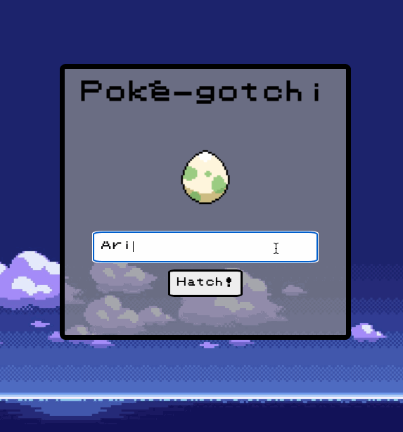
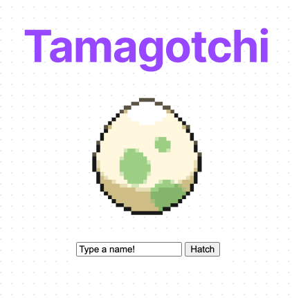
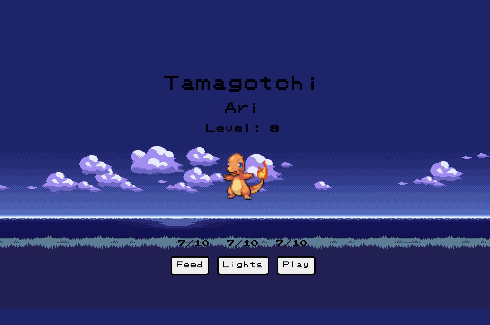
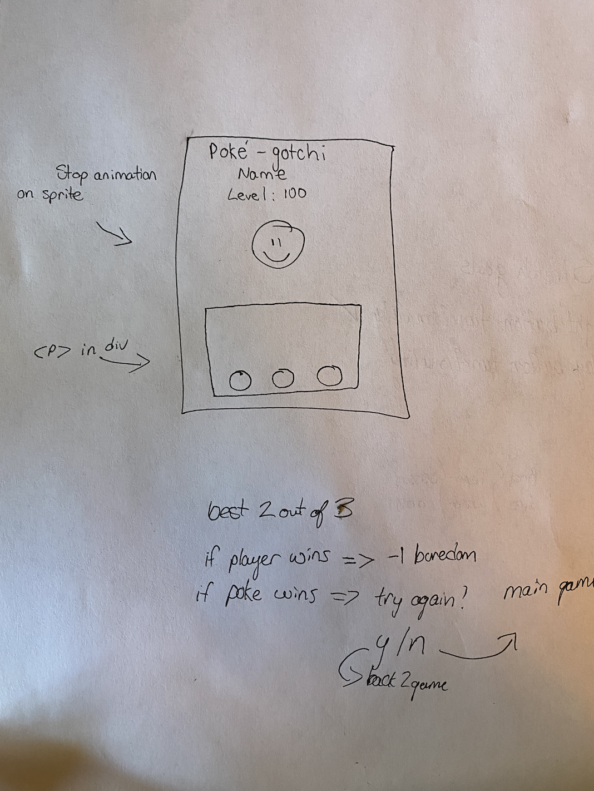

# Tamagotchi

Project 0 for the GA SEI class

Git Link for project requirements: https://git.generalassemb.ly/wc-seir-726/project-zero

******************************************

## Project Goals

******************************************
The project goal here is to create a customized version of the old school "Tamagotchi" games. I chose this game because of the choices offered, this was the one that genuinely excited me. I felt a nostalgic pull and had an immediate idea for a crossover with Pokémon. This was definitely the more challenging of the two games but I had a feeling that my excitement would motivate me to take on the additional challenge and continue learning more fundamentals in JavaScript and DOM manipulation.
******************************************

## Technologies used: HTML, CSS, JavaScript.

******************************************
I designed an initial page layout of how I wanted the game structured. The idea for something reminiscent of the old school flash player days with 8bit GBA font was the one that stuck, so I built this in the spirit of the hand held Tamagotchi style mixed with elements of the GBA Pokémon days.

After the basic layout was completed, I worked on building the character creation from the ground up, taking into consideration that the player would want to name their character and that the stats would have to automatically increment up to the game over cap - the lose condition.

The buttons trigger different scenes and functionality to lower the continually increasing stat counters.

******************************************

## User Stories

******************************************
As a player, I want to be able to intuitively understand how the game is played so that I don't waste time reading instructions. I want to see my score and have a clear understanding of when I lose the game.
Functionality:
1. Name pet
2. Feed pet
3. Toggle lights
4. Play - eventually minigames
5. Evolve
6. Progeny / Archive

******************************************

## Unsolved Problems

******************************************
A few roadblocks were encountered in the button functionality logic. I'm currently figuring out a way to implement mini games when the buttons are clicked to add entertainment value and a semblance of a challenge in keeping your Pokégotchi happy.

CSS also poses a unique challenge with my current knowledge of DOM manipulation. I hope to clean up and polish the graphics in a way that makes them look retro, yet well proportioned.

******************************************

## Next Phase

******************************************

I'd like to continue building on this base game to add even more functionality, playablility, and quirky features such as random sprites, a small chance at a "shiny" Pokémon, the ability for evolution, items and inventory, and multiple generations. Ideally also rewarding the player for hitting level 100, and offering some kind of achievement system or badges that are stored in window memory to be resumed between browser sessions.

******************************************

## Favorite Code Examples

******************************************
This is the basic template for all of the stat timers that also work to create a lose condition.

  >let hungerTimer = null  
  >const startHungerTimer = () => {  
    >hungerTimer = setInterval(gainHunger, >3000)  
  >}  
  >const gainHunger = () => {  
    >if (newTamagotchi.isAlive === false){  
      >clearInterval(hungerTimer)  
    >}else if(hunger === 10) {  
      >clearInterval(boredomTimer)  
      >gameOverHunger()  
    >}else{  
      >hunger = hunger+1  
    >}  
    >newTamagotchi.hunger = hunger  
    >displayNewHunger()  
  >}  
  >const displayNewHunger = () => {  
    >selectHunger.innerText = hunger + "/10"  
  >}  

  Code for the CSS animation while alive

  >.toggle-animation {  
    >animation: 7s linear infinite slidein;  
  >}  
  >@keyframes slidein {    
    >0% { left: -55%; transform:   >rotateY(180deg); }  
    >49.99% { transform: rotateY(180deg) }  
    >50% { left: 90%; transform: >rotateY(0deg)   } 
    >100% { left: -55%; transform: >rotateY(0deg);}  
  >}  

******************************************

## Wireframes

******************************************
**Hatch Screen**  
This is the initial conception of my game. I knew I wanted to use pixel sprites from the original games and the idea of starting with an egg on the screen was perfect.

  
**Game Screen**  
When thinking about what I wanted the game to look like while your pet is alive, I knew I wanted animated sprites with a background from the old Ruby/Sapphire GBA cartridges.

**Rough Conception**  
When thinking about cut-away functionality, it made more sense to actually draw it out with a pen and paper.

